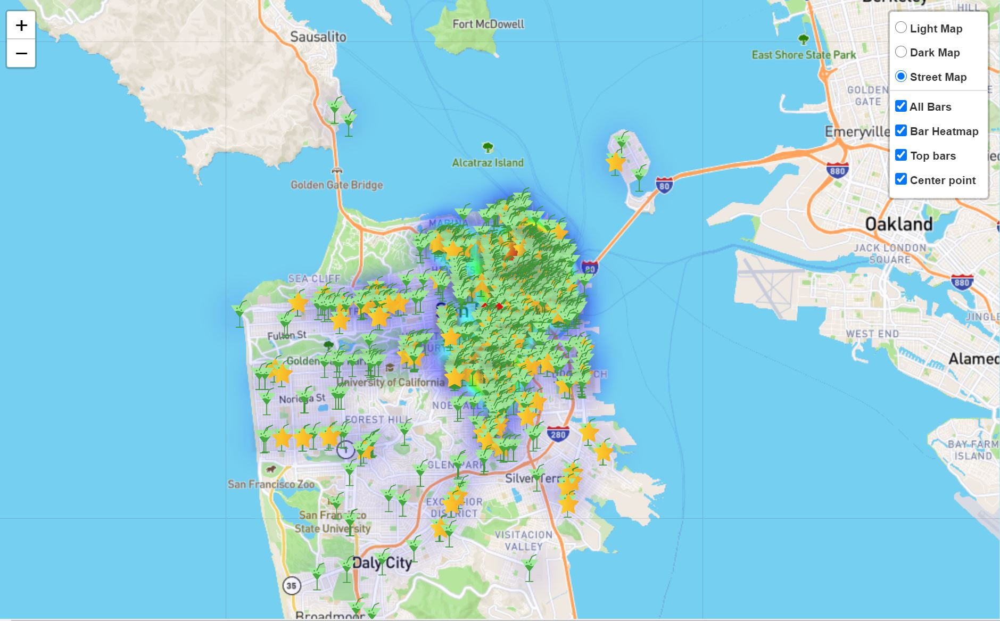
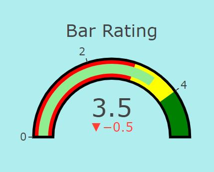
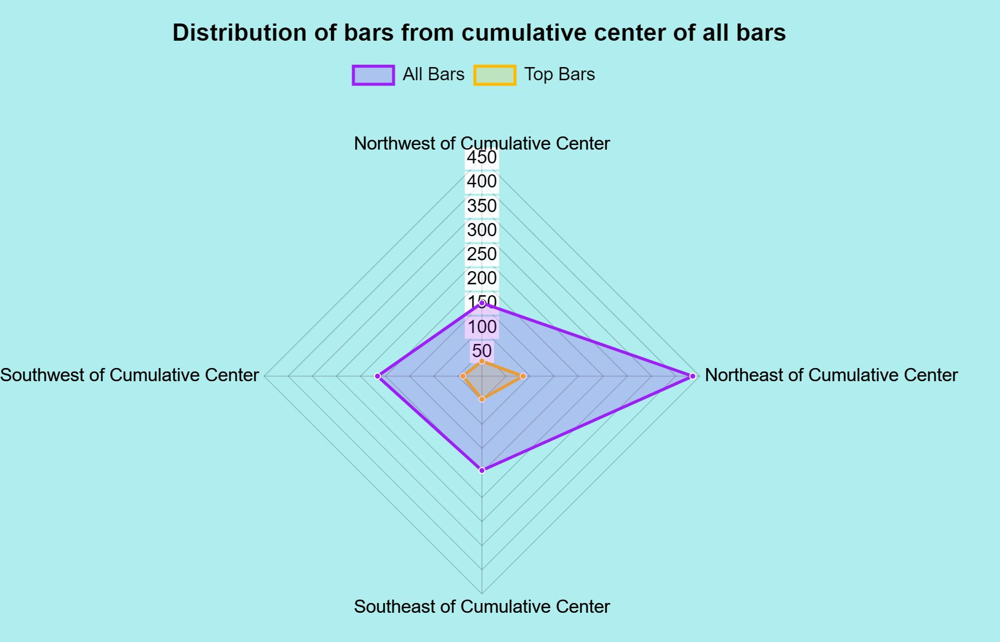
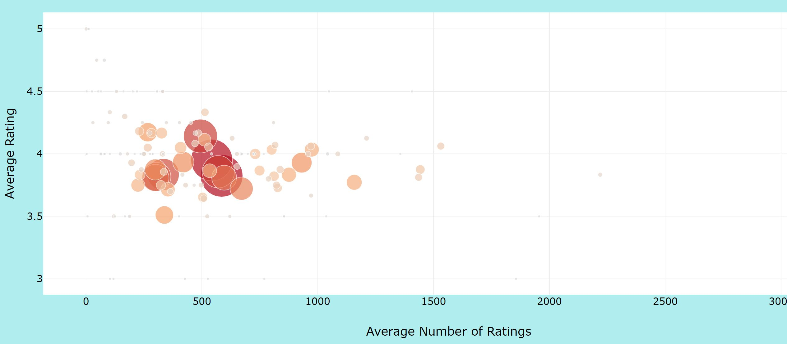
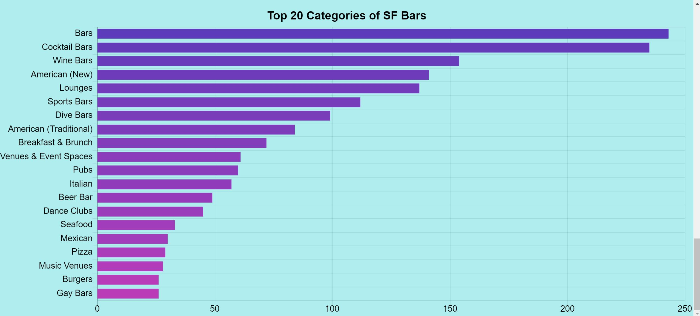

# SF Bars-project

In this project we used the Yelp API for the data, and Plotly, Leaflet, Chart.js, D3.js, JavaScript, CSS, and HTML5 to visualize the data.

We created a map with multiple layers to show the geolocation and information about the bars we had data for. There is an All Bars layer that shows all the bars in th ecity that we have data for, with a pop-up that has a link to the yelp listing, the bars name, the rating, and the phone number. Then there is the Bar heatmap that shows the concentration of bars around the city. There is also the Top Bars layer that shows all bars with a 4.5 or 5 rating, this is a great way to see the best bars to go to in San Francisco. Lastly, there is the central point layer, that shows the centtral point that was used for the chart below the map. 

To the right of the map is a gauge that shows the rating for the bar you click on. When you click to the next bar it shows how much in comparison that rating goes up or down.

Below the map is a chart illustrating the distribution of bars in different directions around the city. We choose a central point on the map (this can be viewed as a layer on the map), and the points on the chart show how many or few bars and top bars are distributed in that direction. We found that northeast of the central point is were the most bars were found, and that the top bars were distributed in the same way.

The next chart is a bubble chart, this chart shows the categories of the bars (each individual bubble) and its average rating and number of reveiws. The bubbles are sized based upon the number of esablishments in the category, and when you hover over it shows the name of the category and the average rating of bars within that category.

The last chart shows the number of bars in each of the top 20 categories of bars. Each bar on the chart cooresponds to a category and when you hover over the bar it shows the number of bars in that category. This chart illustrated that the more generic categories had the most bars, and the more niche categories had less.

The project can be viewed at https://joemiller4500.github.io/d3-project/Basic/. We hope that you enjoy our project and feel free to explore the map and find out which bars you want to visit or avoid!
